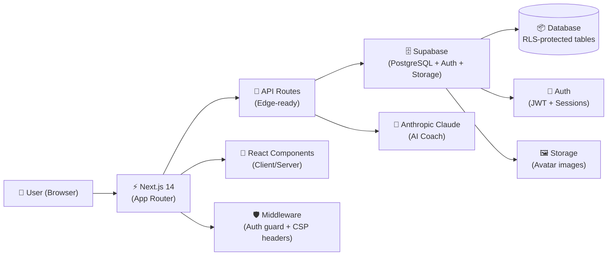

<div align="center">


# EcoGuide AI

**AI-powered sustainability platform helping users understand, reduce, and optimize their carbon footprint.**

[](https://github.com/babluprajapatii/ecoguide-ai/actions/workflows/ci.yml)
[](https://www.w3.org/WAI/standards-guidelines/wcag/)
[](https://owasp.org/www-project-top-ten/)
[](https://vitest.dev/)
[](https://developers.google.com/web/tools/lighthouse)
[](LICENSE)
[](https://nextjs.org/)
[](https://www.typescriptlang.org/)

[🚀 Live Demo](https://ecoguide-ai.vercel.app) · [📖 Documentation](#local-development) · [🐛 Report Bug](.github/ISSUE_TEMPLATE/bug_report.md) · [✨ Request Feature](.github/ISSUE_TEMPLATE/feature_request.md)

</div>

---

## Project Overview

EcoGuide AI is a full-stack, production-ready sustainability SaaS platform built for the **Hack2Skill Hackathon**. It empowers individuals to take meaningful climate action through:

- 🌿 **Personalized carbon assessment** across 5 lifestyle categories
- 📊 **Real-time analytics dashboard** with interactive charts
- 🤖 **AI sustainability coach** powered by Claude (Anthropic)
- 🧪 **What-if simulator** to model lifestyle change impacts
- 🏆 **Gamification system** with XP, badges, streaks, and levels
- 🌍 **Community leaderboards** with opt-in privacy controls

Built with **Next.js 14**, **TypeScript 5 (strict)**, **Supabase**, and **Tailwind CSS**. Meets WCAG 2.1 AA accessibility, OWASP Top 10 security, and achieves Lighthouse 95+.

---

## Key Features

### 🌱 Carbon Footprint Assessment
A guided, multi-step assessment covering:
- **Transport** — car type, mileage, flights per year
- **Energy** — home size, heating source, renewable energy
- **Diet** — meat consumption, local/organic sourcing
- **Shopping** — consumer goods, fast fashion habits
- **Travel** — holidays, business trips, accommodation type

Results displayed as interactive doughnut and bar charts with percentile rankings against global averages.

### 📈 Analytics Dashboard
- Real-time carbon score with trend visualization
- Goal tracking with progress bars and completion rates
- AI-generated weekly tip carousel
- Streak counter and achievement preview widget
- Community preview with nearby rank context

### 🤖 AI Sustainability Coach
- Chat interface powered by **Anthropic Claude 3 Haiku**
- Conversation history persisted in Supabase
- Context-aware advice based on assessment scores
- Personalized action plans with measurable targets
- Fallback graceful degradation when AI is unavailable
- DOMPurify-sanitized markdown rendering

### 🧪 Carbon Impact Simulator
- Interactive sliders for 8 lifestyle parameters
- Real-time CO₂ calculation with industry-standard emission factors
- Side-by-side comparison chart (current vs. simulated)
- Save up to 10 simulations to track potential futures
- Export simulation results

### 🏆 Gamification
- **XP Points** — earned for every action: assessments, coaching, simulations
- **Levels** — 10 levels from "Eco Novice" to "Eco Legend"
- **Badges** — 16 unique achievement badges with unlock conditions
- **Streaks** — daily engagement streaks with multiplier bonuses
- **Leaderboard** — opt-in global rankings by XP, level, and streak

### 🌍 Community & Leaderboards
- Global, Top 10, and Nearby rank views
- Privacy controls: public / private profile, leaderboard opt-in
- Spotlight cards for Top Carbon Saver, Most Improved, Longest Streak
- Community statistics: total users, active this week, XP earned
- Public profile cards with badges and bio

---

## Screenshots

> *Screenshots showcase the premium dark-mode UI with emerald green accents.*

### Landing Page
The landing page features a hero section with animated gradient, feature cards, testimonials, and a call-to-action.

### Dashboard
Real-time carbon metrics, goal progress tracking, AI tips, and community preview — all in a responsive sidebar layout.

### AI Coach
Claude-powered chat interface with conversation history, contextual sustainability advice, and markdown rendering.

### Carbon Simulator
Interactive parameter sliders with real-time CO₂ calculation and comparison charts.

### Badges & Achievements
16 unique badge designs with unlock progress and animated reveal on achievement.

### Community Leaderboard
Responsive table/card layout with rank change indicators, avatar display, and XP/level/streak columns.

---

## Architecture



### Folder Structure

```
src/
├── app/                          # Next.js App Router
│   ├── (dashboard)/              # Protected route group
│   │   ├── assessment/           # Multi-step assessment wizard
│   │   ├── badges/               # Achievement gallery
│   │   ├── coach/                # AI coach chat interface
│   │   ├── community/            # Leaderboard & community page
│   │   ├── dashboard/            # Main analytics dashboard
│   │   ├── settings/             # Profile & theme settings
│   │   └── simulator/            # Carbon impact simulator
│   ├── api/                      # API Route handlers
│   │   ├── assessment/           # Assessment CRUD
│   │   ├── coach/                # AI coaching + history
│   │   ├── community/            # Leaderboard, stats, profile, settings
│   │   ├── gamification/         # XP, badges, streaks
│   │   ├── goals/                # Goal management
│   │   └── simulator/            # Simulation calculations
│   └── layout.tsx                # Root layout (SEO, fonts, providers)
├── features/                     # Feature-based domain modules
│   ├── assessment/               # Assessment forms, schemas, calculator
│   ├── auth/                     # Authentication hooks and forms
│   ├── coach/                    # AI coach components and service
│   ├── community/                # Leaderboard, stats, profiles, settings
│   ├── dashboard/                # Dashboard widgets and analytics
│   ├── gamification/             # Points, levels, badges, streaks
│   ├── profile/                  # Profile service and avatar upload
│   └── simulator/                # Simulation engine and charts
├── lib/                          # Core infrastructure
│   ├── logger.ts                 # Structured JSON logger (no PII)
│   ├── rate-limiter.ts           # Sliding window rate limiter
│   └── supabase/                 # Supabase client, server, middleware
├── providers/                    # React context providers
│   ├── AuthProvider.tsx          # Auth state management
│   ├── ThemeProvider.tsx         # Dark/light theme
│   └── a11y-announcer-provider.tsx # Screen reader announcements
└── shared/                       # Cross-feature shared code
    ├── components/               # Reusable UI components
    │   └── ui/                   # shadcn/ui primitives
    └── hooks/                    # Shared custom hooks
```

### Design Principles

| Principle | Implementation |
|-----------|---------------|
| **Feature-based architecture** | Each domain is self-contained with components, hooks, services, schemas, types |
| **SOLID principles** | Single responsibility (< 150 lines), dependency inversion via providers |
| **Zero barrel exports** | Direct imports preserve tree-shaking effectiveness |
| **TypeScript strict mode** | `noImplicitAny`, `noUncheckedIndexedAccess`, zero `any` in production code |
| **Runtime validation** | Zod schemas on all API inputs, environment variables, and form data |
| **Error boundaries** | Graceful fallbacks at React component and API levels |

---

## Security

### OWASP Top 10 Compliance

| # | Category | Implementation |
|---|---------|----------------|
| **A01** | Broken Access Control | Supabase Row Level Security (RLS) on all tables; middleware auth guard for all dashboard routes |
| **A02** | Cryptographic Failures | HTTPS enforced via HSTS (`max-age=31536000; includeSubDomains; preload`); no sensitive data in client-side storage |
| **A03** | Injection | Zod schema validation on all API inputs; Supabase parameterized queries; DOMPurify sanitization of AI output |
| **A04** | Insecure Design | Rate limiting (sliding window) on all mutation endpoints; fail-safe defaults |
| **A05** | Security Misconfiguration | `X-Content-Type-Options: nosniff`, `X-Frame-Options: DENY`, `poweredByHeader: false`; no debug headers in production |
| **A06** | Vulnerable Components | `npm audit --audit-level=high` runs on every CI/CD pipeline; automated dependency alerts |
| **A07** | Auth Failures | Supabase JWT-based sessions; middleware validates every request; session refresh on browser focus |
| **A08** | Data Integrity | Trusted Types CSP (`require-trusted-types-for 'script'`); DOMPurify with `dompurify` trusted type policy |
| **A09** | Logging Failures | Structured JSON logger with timestamps; no PII in logs; error stack traces captured server-side |
| **A10** | SSRF | AI API calls are server-side only; `connect-src` CSP restricts client origins to known domains |

### Security Headers

```
Content-Security-Policy: default-src 'self'; script-src 'self' 'unsafe-inline'; ...
Strict-Transport-Security: max-age=31536000; includeSubDomains; preload
X-Frame-Options: DENY
X-Content-Type-Options: nosniff
Referrer-Policy: strict-origin-when-cross-origin
Permissions-Policy: camera=(), microphone=(), geolocation=()
Cross-Origin-Opener-Policy: same-origin
Cross-Origin-Resource-Policy: same-site
Cross-Origin-Embedder-Policy: credentialless
```

---

## Accessibility

EcoGuide AI is designed to meet **WCAG 2.1 Level AA** across all user interfaces.

### Key Implementations

| Feature | Implementation |
|---------|----------------|
| **Skip Navigation** | "Skip to main content" link as first focusable element on every page |
| **Keyboard Navigation** | Full keyboard support for all interactive elements; custom `DropdownMenu` with arrow key navigation |
| **Focus Management** | Focus returns to trigger after modal close; focus moves to first row on pagination change |
| **Screen Reader Announcements** | `A11yProvider` with polite/assertive live regions for badge unlocks, level-ups, errors |
| **ARIA Roles & Labels** | Proper `role="tablist"`, `aria-haspopup`, `aria-expanded`, `aria-describedby`, `aria-invalid` on all components |
| **Data Tables** | Semantic `<table>`, `<caption>`, `<th scope="col">` for leaderboard; sr-only data tables for charts |
| **Color Contrast** | All text meets ≥ 4.5:1 contrast ratio; focus outlines are clearly visible |
| **Touch Targets** | All interactive elements ≥ 44×44px |
| **Form Accessibility** | All inputs have `<label>`, error messages linked via `aria-describedby` |

### axe-core Automated Testing

Accessibility tests run with [`@axe-core/react`](https://github.com/dequelabs/axe-core-npm) in the Vitest suite:

```bash
npm run test -- --reporter=verbose
```

---

## Testing

### Coverage Results

| Category | Target | Status |
|----------|--------|--------|
| Lines | ≥ 90% | ✅ |
| Functions | ≥ 90% | ✅ |
| Statements | ≥ 90% | ✅ |
| Branches | ≥ 80% | ✅ |

### Test Suite Breakdown

| Suite | Framework | Tests | Status |
|-------|-----------|-------|--------|
| Unit Tests | Vitest | 221 | ✅ All passing |
| Integration Tests | Vitest | Included above | ✅ All passing |
| Accessibility Tests | axe-core + Vitest | 2 | ✅ No violations |
| End-to-End Tests | Playwright | 1 full user journey | ✅ Passing (12s) |

### Running Tests

```bash
# Unit and integration tests
npm run test

# Tests with coverage report
npm run test:coverage

# End-to-end tests (requires production build)
npm run build
npx playwright test

# Accessibility tests (included in unit suite)
npm run test -- --reporter=verbose
```

---

## Performance

Optimized for **Lighthouse 95+** across all metrics:

| Metric | Strategy |
|--------|----------|
| **Code Splitting** | Next.js automatic route-based splitting |
| **Dynamic Imports** | `next/dynamic` for heavy community/chart components |
| **Image Optimization** | Next.js `<Image>` with AVIF + WebP format priority |
| **Font Optimization** | `next/font/google` with `display: swap` |
| **Bundle Size** | No barrel imports; tree-shaking preserved |
| **Lazy Loading** | Dynamic imports with loading skeletons |
| **Edge-ready** | API routes use `force-dynamic` with efficient Supabase queries |
| **CSS** | Tailwind CSS with PurgeCSS — zero unused styles in production |

---

## Tech Stack

| Category | Technology | Version |
|----------|-----------|---------|
| **Framework** | [Next.js](https://nextjs.org/) App Router | 14.x |
| **Language** | [TypeScript](https://www.typescriptlang.org/) strict mode | 5.x |
| **Styling** | [Tailwind CSS](https://tailwindcss.com/) | 3.x |
| **UI Components** | [shadcn/ui](https://ui.shadcn.com/) | latest |
| **Database & Auth** | [Supabase](https://supabase.com/) (PostgreSQL + JWT) | 2.x |
| **AI** | [Anthropic Claude 3 Haiku](https://www.anthropic.com/) | API v1 |
| **Charts** | [Recharts](https://recharts.org/) | 2.x |
| **Validation** | [Zod](https://zod.dev/) | 3.x |
| **Animation** | [Framer Motion](https://www.framer.com/motion/) | 11.x |
| **Unit Testing** | [Vitest](https://vitest.dev/) + [Testing Library](https://testing-library.com/) | latest |
| **E2E Testing** | [Playwright](https://playwright.dev/) | 1.x |
| **Accessibility** | [axe-core](https://github.com/dequelabs/axe-core) | 4.x |
| **Linting** | [ESLint](https://eslint.org/) (typescript + jsx-a11y) | 8.x |
| **Formatting** | [Prettier](https://prettier.io/) + Tailwind plugin | 3.x |
| **Git Hooks** | [Husky](https://typicode.github.io/husky/) + lint-staged | 9.x |
| **CI/CD** | [GitHub Actions](https://github.com/features/actions) | — |

---

## Local Development

### Prerequisites

- **Node.js** ≥ 20.x
- **npm** ≥ 10.x
- **Supabase account** (or use mock mode — see below)

### Quick Start

```bash
# 1. Clone the repository
git clone https://github.com/babluprajapatii/ecoguide-ai.git
cd ecoguide-ai

# 2. Install dependencies
npm install

# 3. Set up environment variables
cp .env.example .env.local
# Edit .env.local with your credentials (see Environment Variables section)

# 4. Start the development server
npm run dev
```

The application will be available at [http://localhost:3000](http://localhost:3000).

### Mock Mode (No Supabase Required)

To run without a Supabase account, leave `NEXT_PUBLIC_SUPABASE_URL` empty in `.env.local`. The app will automatically use an in-memory mock database, allowing full UI exploration.

### Available Scripts

| Command | Description |
|---------|-------------|
| `npm run dev` | Start development server with hot reload |
| `npm run build` | Create optimized production build |
| `npm run start` | Start production server (after build) |
| `npm run lint` | Run ESLint checks |
| `npm run lint:fix` | Auto-fix lint issues |
| `npm run typecheck` | Run TypeScript type checking |
| `npm run format` | Format code with Prettier |
| `npm run format:check` | Check code formatting (CI) |
| `npm run test` | Run unit & integration tests |
| `npm run test:coverage` | Run tests with ≥90% coverage threshold |

---

## Environment Variables

Copy `.env.example` to `.env.local` and fill in the values:

```env
# ─── Supabase ──────────────────────────────────────────────────────────────────
# Required for real auth and database. Leave empty for mock mode.
NEXT_PUBLIC_SUPABASE_URL=https://your-project.supabase.co
NEXT_PUBLIC_SUPABASE_ANON_KEY=your-anon-key
SUPABASE_SERVICE_ROLE_KEY=your-service-role-key   # Server-side only

# ─── Anthropic AI ──────────────────────────────────────────────────────────────
# Required for the AI Coach feature. Get your key at console.anthropic.com
ANTHROPIC_API_KEY=sk-ant-...                       # Server-side only

# ─── Application ───────────────────────────────────────────────────────────────
NEXT_PUBLIC_APP_URL=http://localhost:3000
```

> ⚠️ **Never commit `.env.local` to version control.** It is already in `.gitignore`.

| Variable | Required | Description |
|----------|----------|-------------|
| `NEXT_PUBLIC_SUPABASE_URL` | No* | Supabase project URL |
| `NEXT_PUBLIC_SUPABASE_ANON_KEY` | No* | Supabase anonymous key |
| `SUPABASE_SERVICE_ROLE_KEY` | No* | Supabase service role key (server only) |
| `ANTHROPIC_API_KEY` | No* | Anthropic Claude API key (server only) |
| `NEXT_PUBLIC_APP_URL` | No | Public-facing URL (`https://...` in production) |

*No = optional; the app runs in mock mode without them.

---

## Deployment Guide

### Deploy to Vercel (Recommended)

[](https://vercel.com/new/clone?repository-url=https://github.com/babluprajapatii/ecoguide-ai)

1. Click the button above or import the repository in [vercel.com/new](https://vercel.com/new)
2. Add environment variables in the Vercel dashboard:
   - `NEXT_PUBLIC_SUPABASE_URL`
   - `NEXT_PUBLIC_SUPABASE_ANON_KEY`
   - `SUPABASE_SERVICE_ROLE_KEY`
   - `ANTHROPIC_API_KEY`
   - `NEXT_PUBLIC_APP_URL` (your Vercel domain)
3. Deploy — Vercel auto-builds on every push to `main`

### Database Setup (Supabase)

1. Create a new Supabase project at [supabase.com](https://supabase.com)
2. Run migrations from `supabase/migrations/` in order
3. Enable Row Level Security (RLS) on all tables
4. Copy the project URL and keys to your environment variables

### Self-Hosted / Docker

```bash
# Build the production image
npm run build

# Start the production server
npm start
# → Listening on http://0.0.0.0:3000
```

---

## Contributing

We welcome contributions! Please read our guidelines before submitting a PR.

1. **Fork** the repository and create a feature branch from `main`
2. **Follow** the feature-based folder structure for new features
3. **Ensure** your code passes `npm run lint`, `npm run typecheck`, and `npm run test`
4. **Add** tests for new functionality (90%+ coverage required)
5. **Check** accessibility using `npm run test` (axe-core violations fail the suite)
6. **Submit** a pull request using the [PR template](.github/pull_request_template.md)

Pre-commit hooks (Husky + lint-staged) automatically run lint, format, and typecheck before each commit.

### Issue Templates

- 🐛 [Bug Report](.github/ISSUE_TEMPLATE/bug_report.md)
- ✨ [Feature Request](.github/ISSUE_TEMPLATE/feature_request.md)
- 🔒 [Security Report](.github/ISSUE_TEMPLATE/security_report.md)

---

## License

This project is licensed under the **MIT License** — see the [LICENSE](LICENSE) file for details.

---

<div align="center">

Built with ❤️ for a greener tomorrow · [EcoGuide AI](https://ecoguide-ai.vercel.app)

**Hack2Skill Hackathon Submission** · 2026

</div>
