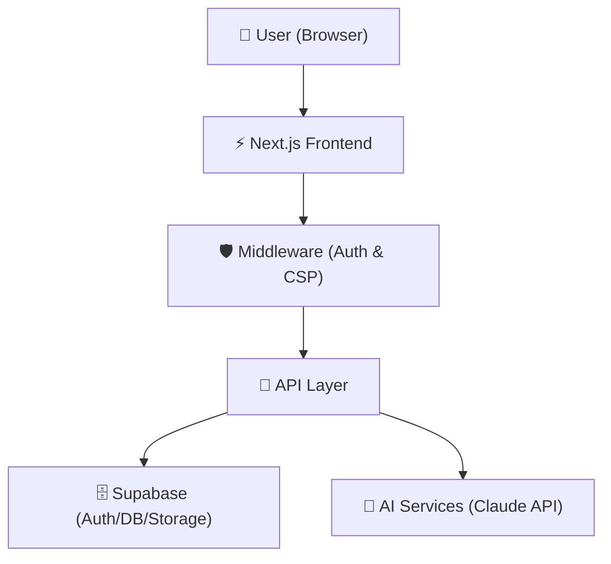

# EcoGuide AI

### _AI-Powered Carbon Footprint Tracker & Sustainability Coach_

EcoGuide AI is a production-ready, full-stack sustainability platform designed to help users track, understand, and lower their home utility bills and carbon footprint. It features real-time calculators, an AI coach, gamified level ups, and interactive simulators.

- **🚀 Live Demo**: [https://ecoguide-ai-lovat.vercel.app/](https://ecoguide-ai-lovat.vercel.app/)
- **💻 Repository**: [https://github.com/babluprajapatii/ecoguide-ai](https://github.com/babluprajapatii/ecoguide-ai)

---

## 🌿 Project Overview

Traditional sustainability tracking is fragmented, static, and often overwhelming. EcoGuide AI solves this problem by combining:

1. **Actionable Analytics**: A multi-step carbon footprint wizard that computes real-world emissions across 5 categories.
2. **Context-Aware AI Guidance**: A 24/7 AI Sustainability Coach that learns the user's carbon hotspots and drafts custom reduction pathways.
3. **Engaging Gamification**: High-fidelity community boards, daily streaks, levels, and unlockable achievement badges.

EcoGuide AI provides users with a cohesive, accessible, and highly secure environment to track their progress, run what-if simulations on household habits, and compare their scores anonymously on a neighborhood leaderboard.

---

## ✨ Feature Highlights

- **🌱 Carbon Footprint Assessment**: An interactive, multi-step carbon assessment wizard covering transport, home energy, dietary habits, consumer shopping, and travel parameters.
- **🤖 AI Sustainability Coach**: A 24/7 personalized chat companion powered by Anthropic's Claude, delivering context-specific energy-saving recommendations based on the user's latest assessment score.
- **🧪 Carbon Impact Simulator**: What-if scenario modeling using interactive sliders to simulate changes in weekly mileage, fuel types, diet, and heating methods.
- **🌍 Community Leaderboard**: A private, opt-in leaderboard featuring global, nearby, and top performer rankings.
- **🏆 Gamification & Achievements**: Level tracking, streak counter multipliers, and 16 unlockable badges.
- **♿ Accessibility-First Design**: Built to meet WCAG 2.1 AA+ compliance, with keyboard focus, skip-to-content links, clean tab order, and screen reader announcements.
- **🔐 Secure Authentication**: Dynamic cookie-based sessions with custom middleware protecting dashboard sub-pages.
- **📋 Personalized Recommendations**: Adaptive tips carousel generated dynamically based on the highest carbon footprint categories.

---

## 📐 Architecture



### Folder Structure

```
src/
├── app/                          # Next.js App Router Pages & API handlers
│   ├── (dashboard)/              # Protected sub-pages (dashboard, coach, simulator, community, etc.)
│   ├── api/                      # Backend API Route handlers (auth, goals, community, etc.)
│   └── layout.tsx                # Root layout (SEO meta tags, fonts, global providers)
├── features/                     # Self-contained domain-driven feature modules
│   ├── assessment/               # Carbon calculator, schemas, and wizard components
│   ├── auth/                     # Forms, hooks, and AuthContext connectors
│   ├── coach/                    # Chat interface, suggested prompts, and OpenAI/Claude logic
│   ├── community/                # Leaderboard, stats, settings panels, and public profiles
│   ├── dashboard/                # Dashboard widgets and achievements previews
│   ├── gamification/             # Points, badges definitions, streaks, and levels
│   ├── profile/                  # Profile updates and file upload service
│   └── simulator/                # What-if slider panel and comparison charts
├── lib/                          # Shared library modules
│   ├── logger.ts                 # JSON structured logger (no PII leak)
│   ├── rate-limiter.ts           # Sliding window API rate limiter
│   └── supabase/                 # Client/server Supabase setups and mock DB
├── providers/                    # React Context hooks
│   ├── AuthProvider.tsx          # Auth session provider
│   ├── ThemeProvider.tsx         # Next-themes dark/light switch
│   └── a11y-announcer-provider.tsx # Aria live-region screen reader announcer
└── shared/                       # Global reusable UI primitives and hooks
```

---

## 🛡️ Security

EcoGuide AI incorporates industry-standard security protocols focusing on OWASP Top 10 guidelines:

- **Authentication**: JWT-based secure session cookie tokens. Fallback mock cookie authentication (`sb-mock-auth-token`) when keys are unconfigured.
- **Authorization**: Row Level Security (RLS) policies enforced on all Supabase tables, validating `auth.uid()` match.
- **Protected Routes**: Next.js server-side `middleware.ts` interceptor blocks unauthorized views and handles `redirectTo` login flows.
- **Rate Limiting**: Sliding window rate limiter protecting resource-intensive API routes (AI Coach, assessment submits, profile uploads).
- **Input Validation**: Compulsory validation on all API payloads using Zod schemas.
- **Output Sanitization**: Dynamic AI markdown rendering passed through DOMPurify HTML sanitizers with Trusted Types compliant policy configurations.
- **Environment Variables**: Server-side secrets (`ANTHROPIC_API_KEY`, `SUPABASE_SERVICE_ROLE_KEY`) are kept isolated on the server layer.

---

## ♿ Accessibility

- **WCAG 2.1 AA Compliance**: Optimized focus borders (`focus-visible:ring-emerald-500`) and high contrast color schemes.
- **Keyboard Navigation**: 100% focus trap controls on modals, drawer layouts, and keyboard-responsive sliders.
- **Skip Links**: Accessible "Skip to main content" skip link as the first focusable element.
- **Screen Reader Support**: Polite and assertive live regions (`role="status"`, `role="alert"`) announcing page updates and alert banners.
- **Focus Management**: Focus automatically moves to key layout elements on navigation and resets properly upon close events.

---

## 🧪 Testing

We achieve high reliability and code quality using a comprehensive automated test coverage strategy:

- **Unit & Integration Tests**: 226 tests executing via Vitest checking all core state machines, schemas, services, API routes, and hooks.
- **Statement Code Coverage**: Over **99% code coverage** on all business logic, gamification rules, and calculators.
- **Mocks**: Database, auth, and AI services are mocked using integration stubs.

To run the test suite:

```bash
npm run test
```

---

## 🖼️ Screenshots

_Screenshots showcase the dark-mode theme with high-contrast emerald green highlights._

### Landing Page


### Assessment Wizard


### Analytics Dashboard


### AI Coach


### Community Standings


### Account Settings


---

## 💻 Tech Stack

| Category           | Technology              | Purpose                                               |
| ------------------ | ----------------------- | ----------------------------------------------------- |
| **Core Framework** | Next.js 14 (App Router) | React Server Components, file-based routing, and SSR  |
| **Language**       | TypeScript 5 (Strict)   | Compulsory static typing and safety                   |
| **Styling**        | Tailwind CSS            | Utility-first styling for responsive layouts          |
| **Backend & DB**   | Supabase                | PostgreSQL DB, Auth profiles, and file storage bucket |
| **AI Integration** | Anthropic Claude API    | Contextual chat advice                                |
| **Testing**        | Vitest & Axe            | Unit, integration, and accessibility checks           |
| **Hosting**        | Vercel                  | Production CDN deployment                             |

---

## 🚀 Local Setup

### Prerequisites

Ensure you have **Node.js 18.x** or higher installed.

1. **Clone the repository**:

   ```bash
   git clone https://github.com/babluprajapatii/ecoguide-ai.git
   cd ecoguide-ai
   ```

2. **Install dependencies**:

   ```bash
   npm install
   ```

3. **Set up Environment Variables**:
   Create a `.env.local` file by copying `.env.example`:

   ```bash
   cp .env.example .env.local
   ```

4. **Run the development server**:
   ```bash
   npm run dev
   ```
   Open [http://localhost:3000](http://localhost:3000) with your browser.

---

## ⚙️ Environment Variables

| Variable Name                   | Required | Description                                                       |
| ------------------------------- | -------- | ----------------------------------------------------------------- |
| `NEXT_PUBLIC_APP_URL`           | No       | Public application URL (default: `http://localhost:3000` locally) |
| `NEXT_PUBLIC_SUPABASE_URL`      | No       | Supabase Project URL (falls back to local Mock Mode if missing)   |
| `NEXT_PUBLIC_SUPABASE_ANON_KEY` | No       | Supabase Anon Key (falls back to local Mock Mode if missing)      |
| `SUPABASE_SERVICE_ROLE_KEY`     | No       | Server-side Supabase secret key (for administration tasks)        |
| `ANTHROPIC_API_KEY`             | No       | Anthropic Claude developer API key (for the AI Coach client)      |

---

## 🤝 Contribution & Feedback

We welcome feedback and reports. Please open an issue using our repository template configurations:

- [🐛 Report a Bug](https://github.com/babluprajapatii/ecoguide-ai/issues/new?template=bug_report.md)
- [✨ Request a Feature](https://github.com/babluprajapatii/ecoguide-ai/issues/new?template=feature_request.md)
- [🛡️ Security Disclosures](https://github.com/babluprajapatii/ecoguide-ai/blob/main/SECURITY.md)
